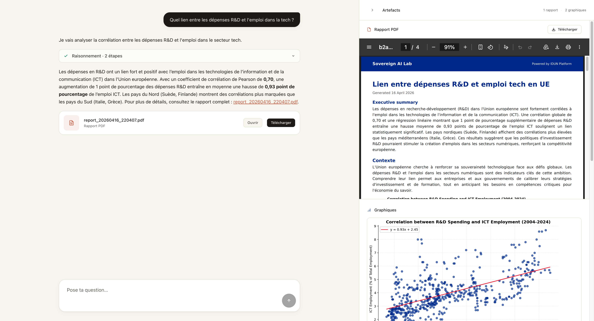

# Sovereign AI Lab

Démonstration préparée pour un cours à IMT-BS. Le programme reçoit une question en français sur l'économie ou le numérique en Europe, planifie une analyse, exécute du code Python sur des jeux de données Eurostat, produit des graphiques et un rapport PDF.



## Ce qu'il y a dedans

- un graphe LangGraph à six étapes (accusé de réception, planification, analyse, exécution des outils, rédaction du rapport, réponse)
- un environnement Python bac-à-sable avec `pandas` et `matplotlib` préchargés
- une recherche DuckDuckGo utilisée par la rédaction du rapport pour le contexte externe
- sept fichiers CSV téléchargés depuis Eurostat au premier lancement
- un frontend Next.js qui parle le protocole AG-UI

## Prérequis

- `git`, `node` 18+, `npm`
- `uv` (installé automatiquement par le script si absent)
- une clé API Groq (gratuite sur https://console.groq.com)

## Installation

**macOS / Linux**

```bash
curl -fsSL https://raw.githubusercontent.com/Idun-Group/imt-lab/main/install.sh | bash
```

**Windows (PowerShell)**

```powershell
irm https://raw.githubusercontent.com/Idun-Group/imt-lab/main/install.ps1 | iex
```

Le script clone le dépôt dans `~/imt-lab`, installe les dépendances Python (via `uv`) et Node, demande la clé Groq puis la sauvegarde dans `.env`, télécharge les jeux de données Eurostat, et lance les deux serveurs.

Une fois lancé :

- interface : http://localhost:3000
- API (AG-UI) : http://localhost:8001

## Jeux de données

Téléchargés depuis Eurostat par `scripts/fetch_data.py` :

| fichier | indicateur |
| --- | --- |
| `ai_adoption_eu.csv` | part des entreprises utilisant une technologie d'IA |
| `digital_skills_eu.csv` | part des individus ayant au moins des compétences numériques de base |
| `ecommerce_eu.csv` | part des individus ayant acheté en ligne sur 3 mois |
| `cloud_adoption_eu.csv` | part des entreprises utilisant des services cloud |
| `gdp_eu.csv` | PIB aux prix courants |
| `rd_spending_eu.csv` | dépenses R&D en pourcentage du PIB |
| `ict_employment_eu.csv` | part des spécialistes ICT dans l'emploi total |

## Lancement manuel

Sans le script d'installation :

```bash
uv sync
cp .env.example .env        # puis y coller GROQ_API_KEY
uv run python scripts/fetch_data.py
cd web && npm install && cd ..
```

Puis, dans deux terminaux séparés :

```bash
uv run idun agent serve --file --path config.yaml
```

```bash
cd web && npm run dev
```
